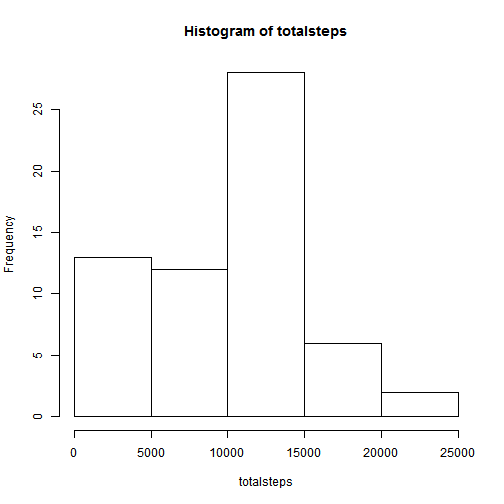
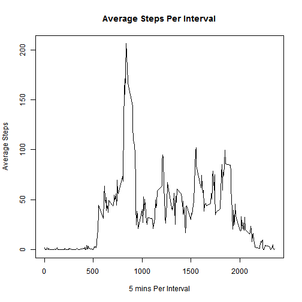
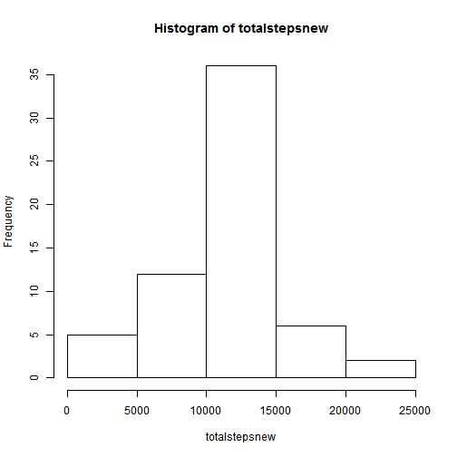
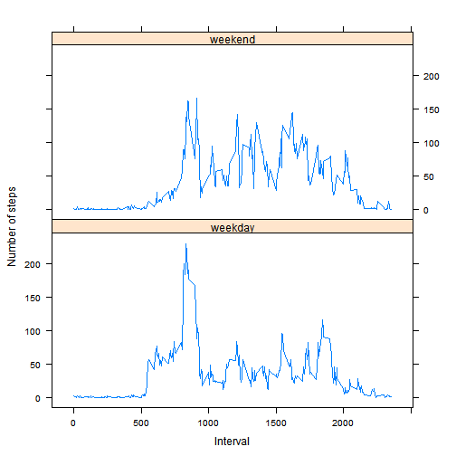

<<<<<<< HEAD
My First R Markdown File
========================

This is the course project 1 for Reproducible Research course.


```r
knitr::opts_chunk$set(echo = TRUE, results = "asis")
```

####1. reading in the dataset and processing the data

```r
data <- read.csv("activity.csv", header = TRUE, sep = ",")
```

####2. histogram of the total number of steps taken each day

```r
totalsteps<- with(data,tapply(steps,date,sum,na.rm=T))
hist(totalsteps)
```



####3. Mean and median number of the total steps taken each day

```r
mean(totalsteps)
```

[1] 9354.23

```r
median(totalsteps)
```

[1] 10395

####4. Time series plot of the average number of steps taken

```r
library(dplyr)
avesteps <- data %>% group_by(interval) %>% summarize(avesteps=mean(steps,na.rm=TRUE))
plot(avesteps,type="l",xlab="5 mins Per Interval", ylab="Average Steps", main ="Average Steps Per Interval")
```



####5. The 5-minute interval that, on average, contains the maximum number of steps

```r
avesteps$interval[which.max(avesteps$avesteps)]
```

[1] 835

####6. Code to describe and show a strategy for imputing missing data

```r
sum((rowSums(is.na(data)))>=1)
```

[1] 2304

```r
newdata<-merge(data,avesteps,by="interval",all=TRUE)
index<-is.na(newdata$steps)
newdata$steps[index]<-newdata$avesteps[index]
newdata<-newdata[order(newdata$date),1:3]
```

####7. Histogram of the total number of steps taken each day after missing values are imputed

```r
totalstepsnew<- with(newdata,tapply(steps,date,sum,na.rm=T))
hist(totalstepsnew)
```



```r
mean(totalstepsnew)
```

[1] 10766.19

```r
median(totalstepsnew)
```

[1] 10766.19

####8. Panel plot comparing the average number of steps taken per 5-minute interval across weekdays and weekends

```r
library(lattice)
Sys.setlocale("LC_TIME","C")
```

[1] "C"

```r
newdata$date<-as.Date(newdata$date)
weekend<-weekdays(newdata$date) %in% c("Saturday","Sunday")
newdata$weeks<-factor(weekend,labels=c("weekday","weekend"))
aveactivitydata<-aggregate(steps~interval+weeks,data=newdata,FUN="mean")
with(aveactivitydata,xyplot(steps~interval|weeks,layout=c(1,2),type="l",ylab="Number of steps",xlab="Interval"))
```



####9. All the R code needed to reproduce the results in the report
=======
My First R Markdown File
========================

This is the course project 1 for Reproducible Research course.


```r
knitr::opts_chunk$set(echo = TRUE, results = "asis")
```

####1. reading in the dataset and processing the data

```r
data <- read.csv("activity.csv", header = TRUE, sep = ",")
```

####2. histogram of the total number of steps taken each day

```r
totalsteps<- with(data,tapply(steps,date,sum,na.rm=T))
hist(totalsteps)
```


####3. Mean and median number of the total steps taken each day

```r
mean(totalsteps)
```

[1] 9354.23

```r
median(totalsteps)
```

[1] 10395

####4. Time series plot of the average number of steps taken

```r
library(dplyr)
avesteps <- data %>% group_by(interval) %>% summarize(avesteps=mean(steps,na.rm=TRUE))
plot(avesteps,type="l",xlab="5 mins Per Interval", ylab="Average Steps", main ="Average Steps Per Interval")
```


####5. The 5-minute interval that, on average, contains the maximum number of steps

```r
avesteps$interval[which.max(avesteps$avesteps)]
```

[1] 835

####6. Code to describe and show a strategy for imputing missing data

```r
sum((rowSums(is.na(data)))>=1)
```

[1] 2304

```r
newdata<-merge(data,avesteps,by="interval",all=TRUE)
index<-is.na(newdata$steps)
newdata$steps[index]<-newdata$avesteps[index]
newdata<-newdata[order(newdata$date),1:3]
```

####7. Histogram of the total number of steps taken each day after missing values are imputed

```r
totalstepsnew<- with(newdata,tapply(steps,date,sum,na.rm=T))
hist(totalstepsnew)
```


```r
mean(totalstepsnew)
```

[1] 10766.19

```r
median(totalstepsnew)
```

[1] 10766.19

####8. Panel plot comparing the average number of steps taken per 5-minute interval across weekdays and weekends

```r
library(lattice)
Sys.setlocale("LC_TIME","C")
```

[1] "C"

```r
newdata$date<-as.Date(newdata$date)
weekend<-weekdays(newdata$date) %in% c("Saturday","Sunday")
newdata$weeks<-factor(weekend,labels=c("weekday","weekend"))
aveactivitydata<-aggregate(steps~interval+weeks,data=newdata,FUN="mean")
with(aveactivitydata,xyplot(steps~interval|weeks,layout=c(1,2),type="l",ylab="Number of steps",xlab="Interval"))
```


####9. All the R code needed to reproduce the results in the report
>>>>>>> 8e640cc60f17117dab79e3828878ec6d9edb2f78
